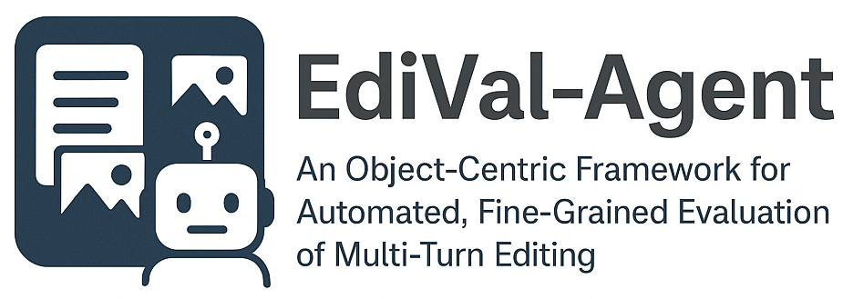

<h2 style="font-weight: bold; margin-top: 11px;">
  EdiVal-Agent: An Object-Centric Framework for Automated, Fine-Grained Evaluation of Multi-Turn Editing
</h2>

> Want to run EdiVal-Agent on your own images? Jump to the [Bring Your Own Images](#bring-your-own-images) section for a step-by-step walkthrough.

<!--- BADGES: START --->
[](https://lbesson.mit-license.org/)
[](https://creativecommons.org/licenses/by-sa/4.0/)
[](https://arxiv.org/abs/2509.13399)
[](https://huggingface.co/papers/2509.13399)
[](https://huggingface.co/datasets/C-Tianyu/EdiVal)
</br>
[](https://tianyucodings.github.io/EdiVAL-page/)
[](https://tianyucodings.github.io/EdiVAL-page/)
<!--- BADGES: END --->

[Project Website](https://tianyucodings.github.io/EdiVAL-page/) • [Hugging Face Repository](https://huggingface.co/datasets/C-Tianyu/EdiVal)

Welcome to the official repository for **EdiVal-Agent: An Object-Centric Framework for Automated, Fine-Grained Evaluation of Multi-Turn Editing** ([arXiv:2509.13399](https://arxiv.org/abs/2509.13399)). With the toolkit in this repo you can **generate fresh multi-turn instructions**, **run your own editing models** (or ours) against the benchmark, **evaluate instruction-following, consistency, and quality** across turns, and **reproduce every experiment from the paper** with the provided scripts and notebooks.

<details>
<summary><strong>Table of Contents</strong></summary>

- [Overview](#overview)
- [Overall Multi-Turn Editing Leaderboard](#overall-multi-turn-editing-leaderboard)
- [Repository Structure](#repository-structure)
- [Getting Started](#getting-started)
- [Data Hub](#data-hub)
- [Instruction Generation Pipeline](#instruction-generation-pipeline)
- [Image Generation](#image-generation)
- [Evaluation](#evaluation)
- [Analysis \& Reproduction](#analysis--reproduction)
- [Bring Your Own Images](#bring-your-own-images)
- [Citation](#citation)
- [Support \& Updates](#support--updates)
</details>


---

## Overview

- **Goal:** benchmark instruction-following, consistency and perceptual quality in sequential (multi-turn) image editing.
- **Inputs:** 512×512 images and curated 3-turn editing instructions.
- **Outputs:** multipass & singlepass generations, instruction-following scores, consistency metrics, and quality scores (including optional HPSv3).

---


## Overall Multi-Turn Editing Leaderboard

| Rank | Creator | Model | Technique | Score | Release |
| --- | --- | --- | --- | --- | --- |
| 1🥇 |  ByteDance | Seedream 4.0 | Unknown | 59.76 | Sep 2025 |
| 2🥈 |  Google | Nano Banana | Unknown | 56.24 | Aug 2025 |
| 3🥉 |  OpenAI | GPT-Image-1 | Unknown | 53.81 | Jul 2025 |
| 4 |  Black Forest Labs | FLUX.1-Kontext-max | Flow Matching | 53.04 | Jun 2025 |
| 5 |  Google | Gemini 2.0 Flash | Unknown | 47.94 | Feb 2025 |
| 6 |  Alibaba | Qwen-Image-Edit | Flow Matching | 41.93 | Aug 2025 |
| 7 |  StepFun | Step1X-Edit | Flow Matching | 38.98 | Apr 2025 |
| 8 |  Black Forest Labs | FLUX.1-Kontext-dev | Flow Matching | 38.71 | Jun 2025 |
| 9 |  VectorSpaceLab | OmniGen | Flow Matching | 29.91 | Sep 2024 |
| 10 | - | UltraEdit | Diffusion | 22.89 | Jul 2024 |
| 11 | - | AnyEdit | Diffusion | 22.50 | Nov 2024 |
| 12 | - | MagicBrush | Diffusion | 19.41 | Jun 2023 |
| 13 | - | InstructPix2Pix | Diffusion | 12.99 | Dec 2023 |

## Repository Structure

- `env_setup/` – Conda environment specification (`env.yaml`) and bootstrap script (`setup_edival.sh`).
- `generate_instructions/` – Full instruction pipeline: object parsing, grounding filter, CSV export, and candidate pools.
- `generate.py` – Use your editor to generated editted images, with Qwen-Image-Edit model as an example.
- `baseline_generate/` – Historical baseline scripts retained for comparison, including GPT-Image-1, Flux models.
- `detector/` – Instruction-following, consistency, and quality evaluation modules.
- `eval.py` / `eval_bash.sh` – Core evaluator and batch helper.
- `example_evaluate_results/` – Reference outputs for sanity checking. Your output should have the similar structure.
- `analysis.ipynb` – Notebook used to analysis your final results in `example_evaluate_results/`.
- `oai_instruction_generation_output.csv` – Sample 3-turn instruction CSV. The instructions we used in our paper.
- `update_hps_scores.py` – Utility to backfill HPSv3 scores into evaluation JSONs. If you need hpsv3 quality score, use this scripts, since hpsv3 score env conflicts with other metrics.

---

## Getting Started

```bash
# 1. Create the environment (once)
bash env_setup/setup_edival.sh

# 2. Activate for every new shell
conda activate edival
```

The bootstrap script installs PyTorch (CUDA 12.1), GroundingDINO (editable mode), diffusers, vLLM dependencies, and all evaluation packages. Modify `env_setup/env.yaml` if you need different versions.

---

## Data Hub

All assets live in the [Hugging Face repository `C-Tianyu/EdiVal`](https://huggingface.co/datasets/C-Tianyu/EdiVal):

- `input_images_resize_512.zip` – canonical 512×512 image set.
- `baseline_generations/*` – pre-generated outputs: GPT-Image-1, Nano Banana, SeedDream v4, etc.

Download the resources you need and place them at the repository root (paths can be overridden via CLI flags).

---

## Instruction Generation Pipeline

All scripts reside in `generate_instructions/`. Candidate vocabularies are stored in `generate_instructions/candidate_pools/`.

> **Before you start:** set `OPENAI_API_KEY` (and optionally `OPENAI_API_BASE` if you use a custom endpoint).

1. **Object Extraction**

   ```bash
   export OPENAI_API_KEY=sk-...
   python generate_instructions/oai_all_objects.py \
     --input-dir input_images_resize_512 \
     --output-dir generate_instructions/oai_all_objects
   ```

   Produces rich JSON metadata (`<index>_input_raw.json`) for every image.

2. **Grounding Filter**

   ```bash
   python generate_instructions/grounding_filter.py \
     --input-dir generate_instructions/oai_all_objects \
     --output-dir generate_instructions/grounding_all_objects \
     --image-dir input_images_resize_512 \
     --num-gpus 2 \
     --box-threshold 0.35 \
     --text-threshold 0.35
   ```

   Uses GroundingDINO to keep only visually grounded objects, adding bounding boxes and counts.

3. **CSV Export**

   ```bash
   export OPENAI_API_KEY=sk-...
   python generate_instructions/oai_instruction_generator.py \
     --grounding-dir generate_instructions/grounding_all_objects \
     --input-images input_images_resize_512 \
     --output oai_instruction_generation_output.csv \
     --seed 42
   ```

   Generates the multi-turn instruction CSV used downstream. Candidate pools come from `generate_instructions/candidate_pools/*.txt`; regenerate them with `generate_instructions/candidate_pools/generate_objects_txt.py` if you need to refresh vocabularies.

---

## Image Generation

Run Qwen/Qwen-Image-Edit (or your own editor) over the instructions:

```bash
python generate.py \
  --csv oai_instruction_generation_output.csv \
  --zip input_images_resize_512.zip \
  --output-dir your_generations \
  --num-gpus 2
```

Outputs land in `your_generations/multipass` and `your_generations/singlepass`. To plug in a custom model, implement a class that exposes `generate_single_edit` and point to it via:

```bash
python generate.py --editor-class my_module:MyCustomGenerator ...
```

---

## Evaluation

1. **Single Folder**

   ```bash
   python eval.py \
     --generation_folder your_generations \
     --modes multipass singlepass
   ```

   Computes instruction-following, consistency, and quality metrics (HPSv3 if available) and writes JSON summaries to `evaluate_results/your_generations/`.

2. **Batch Mode**

   ```bash
   bash eval_bash.sh
   ```

   Adjust `BASE_DIR`, `JOBS`, and `GPU_GROUPS` at the top of the script to suit your hardware; the helper loops over all subfolders in `BASE_DIR`.

3. **Fill in HPSv3 (Optional)**

   ```bash
   python update_hps_scores.py \
     --results_root evaluate_results/your_generations \
     --num_gpus 2 \
     --batch_size 4
   ```

   Backfills missing HPSv3 scores into the evaluation JSONs.

---

## Analysis & Reproduction

- `analysis.ipynb` – Aggregates evaluation outputs and generates the plots/tables from the paper.
- `example_evaluate_results/` – Reference outputs to verify your setup.

Launch Jupyter or VS Code within the `edival` environment to explore the results interactively.

---

## Bring Your Own Images

Want to evaluate your own dataset? Follow the same three-stage pipeline used for EdiVal's release.

1. **Prepare Inputs**
   - Collect/source your raw images (ideally resized to 512×512 for parity with the benchmark).
   - Place the ZIP (or directory) alongside the existing `input_images_resize_512.zip` or point the scripts to your custom location via CLI flags.

2. **Generate Instructions**
   - Run `generate_instructions/oai_all_objects.py` to extract object metadata for every image.
   - Filter the results with `generate_instructions/grounding_filter.py` to keep grounded objects.
   - Export multi-turn instructions using `generate_instructions/oai_instruction_generator.py`, targeting a new CSV (e.g. `my_dataset_instructions.csv`).

3. **Run Editors**
   - Use `generate.py` (or your own editor runner) to create multipass/singlepass generations from the new instruction CSV.
   - Custom editors can be plugged in via `--editor-class` if you want to benchmark alternative diffusion or autoregressive systems.

4. **Evaluate**
   - Invoke `eval.py --generation_folder <path>` (and optionally `eval_bash.sh` for batch jobs) to produce instruction-following, consistency, and quality metrics.
   - If desired, run `update_hps_scores.py` to backfill HPSv3 scores.
   - Feed the outputs into `analysis.ipynb` to generate the same tables/figures used in the paper.

That's it—by mirroring the release pipeline you can obtain apples-to-apples results for any custom image collection.

---


---

## Citation

```
@article{ediValAgent2025,
  title   = {EdiVal-Agent: An Object-Centric Framework for Automated, Fine-Grained Evaluation of Multi-Turn Editing},
  author  = {Tianyu Chen and collaborators},
  journal = {arXiv preprint arXiv:2509.13399},
  year    = {2025}
}
```

---

## Support & Updates

- Latest checkpoints, instruction files, and baseline generations: [Hugging Face `C-Tianyu/EdiVal`](https://huggingface.co/datasets/C-Tianyu/EdiVal)
- Project updates and interactive demos: [EdiVal Website](https://tianyucodings.github.io/EdiVAL-page/)
- Pull requests and issues are welcome if you build new editors, metrics, or analysis tools on top of this codebase.

---

